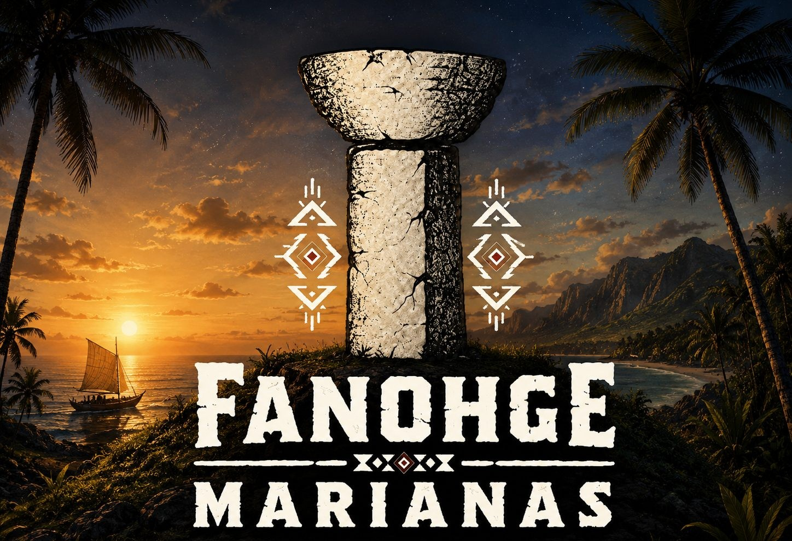

<p align="center">
  
</p>

# Fanohge Marianas

### A Saga of Civilization in the Pacific
**From Latte Stones to Nationhood.**

Build a village. Guide an archipelago. Carry a homeland through centuries of change.

**Fanohge Marianas** is an independent, story-driven civilization strategy game set in the Mariana Islands. Begin in the ancient Chamorro village of **Agingan on Saipan in 1300 CE**, develop your island communities, and navigate the arrival of explorers, colonial administrations, war, and the modern Commonwealth before entering a speculative future you help shape.

The islands are the center of the story. Successive governments change the conditions around you; your task is to sustain the communities living through those changes.

> **The past is scripted. The future is not.**

**Development status:** Playable prototype / test build. Gameplay, balancing, historical events, artwork, models, and browser compatibility remain under active development. Expect rough edges and changes between builds.

Created by **Kelvin Rodeo / KAOZ** as a **KAOZ Theory** project.

## What kind of game is it?

Fanohge combines **turn-based civilization management**, **historical storytelling**, and a **living 3D archipelago**. You build structures, manage resources and population, develop industries, research policies, and respond to events as the timeline advances.

Its historical campaign follows successive eras rather than letting you freely replace the documented past. Your development choices and event responses unfold within that progression. The future phase moves into speculative nation-building, with reunification and independence forming part of the project's future-facing premise.

| At a glance | Description |
| --- | --- |
| Genre | Civilization strategy and historical narrative |
| Setting | The Mariana Islands, beginning on Saipan |
| Timeline | 1300 CE through historical eras into a speculative future |
| Progression | Turn-based development with scripted historical milestones and event decisions |
| Presentation | Interactive 3D islands, evolving settlements, ships, people, era artwork, and music |
| Platform | Web browser |
| Status | Independent project in active development |

## How you play

### Build your islands

Select an island on the board or from the island list, then choose structures to construct. Your early settlement includes **guma', taro patches, proa canoes, and latte stones**. As the timeline advances, the available architecture and development options change with it.

Buildings support your civilization through food production, resources, culture, housing, and other effects. Construction appears on the map, turning your decisions into visible communities.

### Sustain your people

Manage **food, wood, stone, gold, culture, population, and housing**. Consider both what a building costs now and what it contributes over later turns. A growing population needs the capacity and production to support it.

Develop and upgrade industries as opportunities become available. Expansion is useful only when your economy can sustain it.

### Research policies and make decisions

Policies take time to research and can alter the direction of your civilization. Some are associated with democratic or authoritarian government paths; others are available across paths.

Historical and random events interrupt routine development with new circumstances and decisions. Read the choices carefully, respond, and carry their consequences into subsequent turns.

### Advance through time

End your turn to move the simulation forward. Review production, population, research, and events before committing to the next stage of development.

The **Chronicle** records the unfolding story. Expand it to read events, then use its labeled **Minimize** control to return to the islands—particularly useful on a phone.

### Continue your saga

Saved progress is stored locally. When a save is available, use **Continue the Saga** on the title screen to resume. **Begin Anew** starts over and replaces the current run.

Browser saves belong to the browser and site where you played. Clearing site data can remove them; saves do not automatically transfer between browsers or devices.

## The historical journey

Eight broad eras structure the saga. Buildings, visual details, music, political context, and events evolve as the islands move through time.

| Era | The chapter you navigate |
| --- | --- |
| **Ancient Chamorro · 1300–1520** | Begin at Agingan. Build an island community around agriculture, navigation, village life, and latte construction. |
| **Age of Contact · 1521–1667** | Foreign sails arrive, connecting the islands to expanding Pacific routes and new encounters. |
| **Spanish Era** | Navigate missionization, colonial administration, upheaval, and cultural survival. |
| **German Era** | The northern islands enter a brief new colonial chapter shaped by changing administration and trade. |
| **Japanese Era** | Migration, agriculture, industry, and infrastructure transform the northern islands as the Pacific approaches war. |
| **American Era** | War and its aftermath lead into American administration and the Trust Territory period. |
| **Commonwealth Era** | Political union with the United States and modern island life bring new economic and governmental challenges. |
| **Future Era** | Move beyond the historical campaign into speculative choices about the islands' political and economic future. |

These are the game's narrative chapters, not a claim that every Mariana island experienced an identical political timeline. Guam and the Northern Mariana Islands have distinct histories. Historical systems are simplified for play, and future scenarios are fiction rather than predictions.

## A living archipelago

The map is more than a backdrop. Development appears directly on a 3D representation of the islands:

- **Visible construction:** Settlements and structures accumulate as you build.
- **Era-aware presentation:** Architecture, people, ships, flags, and atmosphere reflect the evolving setting.
- **Island selection:** Move between communities to inspect and manage their development.
- **An evolving art pipeline:** Procedural structures and scenery coexist with imported GLB assets, including palm and villager models.
- **Era-specific sound:** A title theme, ambient tracks for the eight eras, and interface sound effects accompany the saga.
- **A fallback map:** An SVG map provides an alternative when the 3D renderer cannot initialize.

The visuals are still being refined. Model placement, animation, scale, rendering performance, and device-specific behavior may vary between test builds.

## Start playing

If this repository includes a hosted game link or a packaged web release, use that build. To run a complete source checkout locally, serve the project directory over HTTP:

```bash
python -m http.server 8000
```

Open **http://localhost:8000** in a modern browser. On Windows, `py -m http.server 8000` is an alternative if `python` is unavailable.

Use the directory containing `index.html`, `style.css`, `js/`, and `assets/`. Serving over HTTP is preferable to opening `index.html` directly because model and texture loading can be restricted under `file://`.

The packaged web build includes a local Three.js bundle. A complete build should not need a CDN connection for the 3D engine. WebGL support is required for the 3D view; audio may begin only after your first click or tap because of browser autoplay rules.

### Your first session

1. Choose **Begin the Saga** on the title screen.
2. Read the introduction and inspect your starting community on Saipan.
3. Review resources, population, and housing before building.
4. Construct what your settlement needs and examine its effects.
5. End the turn, read new events, and check the Chronicle.
6. Keep developing as new eras and opportunities arrive.

## For developers

The game uses **HTML, CSS, and JavaScript**, with **Three.js** for WebGL rendering and **esbuild** for the self-contained board bundle.

| File or directory | Purpose |
| --- | --- |
| `index.html` | Game page and script loading |
| `style.css` | Interface styling and responsive layouts |
| `game-config.json` | Project configuration |
| `js/data.js` | Era, island, building, industry, policy, and event definitions |
| `js/engine.js` | Simulation, construction, turn progression, policy research, and save logic |
| `js/ui.js` | Title screen, controls, panels, decisions, and Chronicle |
| `js/gameboard.js` | Source for the 3D board and asset rendering |
| `js/gameboard.bundle.js` | Bundled board runtime loaded by the packaged game |
| `js/audio.js` | Title music, era music, and sound effects |
| `assets/` | Audio, era artwork, flags, textures, and models |
| `DESIGN.md` | Additional design documentation |

Install the checkout's JavaScript dependencies before working on the rendering source:

```bash
npm install
```

**Source changes must reach the playable build.** Changes to `js/gameboard.js` require rebuilding `js/gameboard.bundle.js`, which is the board runtime loaded by the game. When publishing updates, include the current HTML, CSS, scripts, bundled runtime, and assets so the hosted version reflects the source. Check the checkout's build configuration for its actual bundling commands.

## Development priorities

- Refine resource balancing, pacing, policy effects, and progression.
- Expand and review historical events and narrative decisions.
- Improve models, textures, animation, and terrain placement.
- Continue testing portrait and landscape interfaces across devices.
- Improve rendering reliability and performance across desktop and mobile browsers.
- Develop the speculative future phase and its nation-building choices.

These are ongoing areas of work, not a release schedule or a promise that every planned system is complete.

## Feedback and contributions

Use this repository's **Issues** tab to report bugs, suggest improvements, or flag historical and cultural details that need review.

For a useful bug report, include your build/version, browser and device, screen orientation, steps to reproduce, expected result, actual result, and a screenshot or console error when possible. Note whether you began a new game or continued a save.

Historical corrections are especially welcome when accompanied by a source. For substantial code or asset contributions, open an issue first to discuss scope and compatibility. Check the repository's license and any asset-specific terms before reusing or redistributing code, artwork, music, or models; public availability alone does not grant reuse rights.

## About the creator

**Kelvin Rodeo**, known creatively as **KAOZ**, was born and raised on Saipan. Fanohge Marianas is part of his **KAOZ Theory** body of work, exploring island history, identity, storytelling, and interactive worlds.

Explore more at the [KAOZ Theory Mothership](https://kaoztheory.rodeo).

---

**Build · Endure · Remember · Rise**

*1300 CE → The Future*
